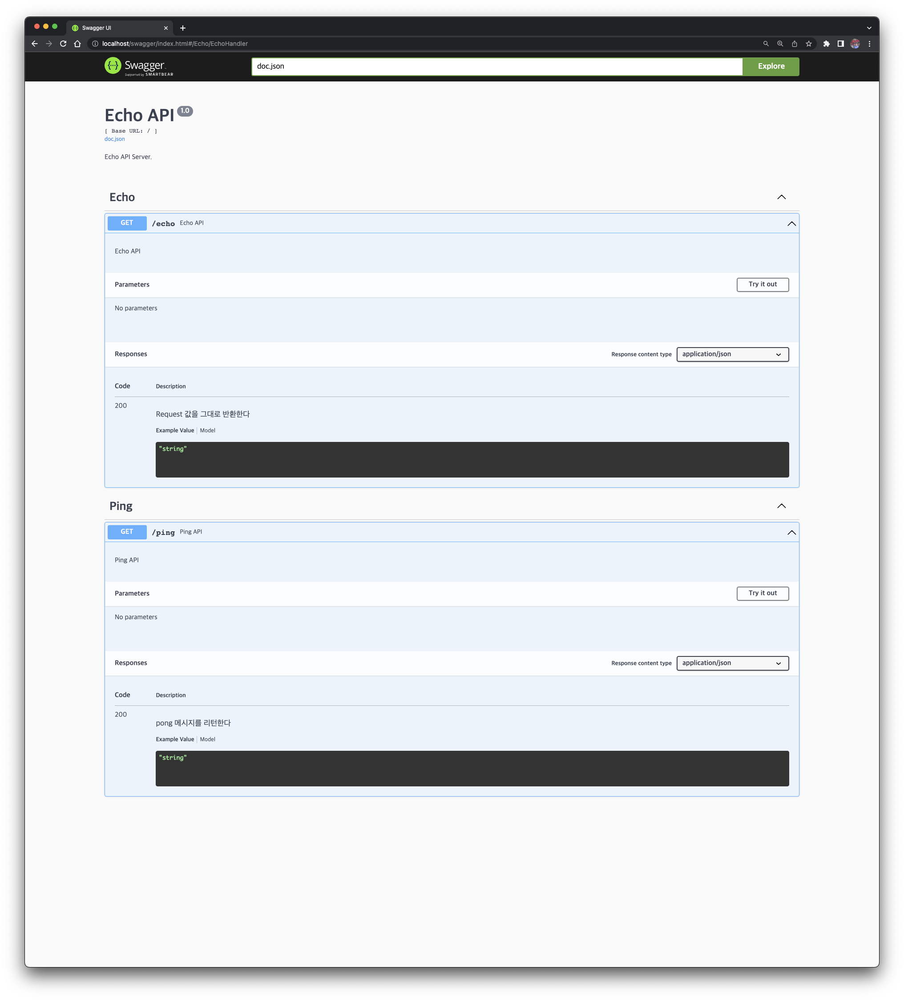

# Echo Server

This is a simple HTTP Echo server. If you send a request value to the API, the server will return the exact same value for the response. 

## Usage

### 1. Build

The build option has already been added to the Makefile file, so you can simply build with the command below. 

```bash
$ make package
```

### 2. Running the server

```bash
$  go run cmd/server/main.go 
```

### 3. Running under Docker

The server can also run with a docker image.

```bash
$ make docker-run
```

## Swagger 

The swagger is already included in the source code, so you can just access from the local machine. 

-  http://localhost/swagger/index.html



